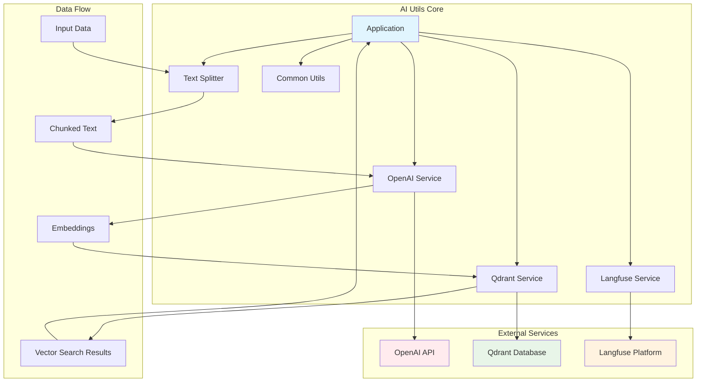

# AI Utils - Complete AI Toolkit for Building AI Agents

AI Utils is a comprehensive Rust library designed to provide all the essential tools needed to build sophisticated AI agents. It integrates multiple AI services and utilities into a unified, async-first API that makes building AI applications simple and efficient.

## 🚀 Key Features

- **OpenAI Integration**: Complete support for chat completions, embeddings, image generation, and audio transcription
- **Vector Database**: Seamless integration with Qdrant for vector storage and similarity search
- **Text Processing**: Advanced text splitting and tokenization with configurable chunking strategies
- **Monitoring**: Built-in Langfuse integration for comprehensive AI application monitoring
- **Async-First**: Built on Tokio for high-performance concurrent operations
- **Type Safety**: Full Rust type safety with comprehensive error handling

## 🏗️ Architecture



## 🎯 Use Cases

- **Chat Bots**: Build conversational AI agents with memory and context
- **Document Q&A**: Create systems that can answer questions from large document collections
- **Image Analysis**: Process and analyze images with multimodal AI capabilities
- **Vector Search**: Implement semantic search across text, images, and other data
- **AI Monitoring**: Track and analyze AI application performance and usage

## 📦 Quick Installation

```bash
# Add to your Cargo.toml
[dependencies]
ai_utils = "0.1.0"
```

## 🔧 Environment Setup

```bash
# Required environment variables
export OPENAI_API_KEY="your-openai-api-key"
export QDRANT_URL="your-qdrant-url"
export QDRANT_API_KEY="your-qdrant-api-key"
export LANGFUSE_PUBLIC_KEY="your-langfuse-public-key"
export LANGFUSE_SECRET_KEY="your-langfuse-secret-key"
```

## 🚀 Quick Start

```rust
use ai_utils::{openai::OpenAIService, text_splitter::TextSplitter};

#[tokio::main]
async fn main() -> Result<(), Box<dyn std::error::Error>> {
    // Initialize services
    let openai = OpenAIService::new();
    let splitter = TextSplitter::new(None);
    
    // Process text and get embeddings
    let text = "Your document content here...";
    let chunks = splitter.split(text, 1000)?;
    
    // Generate embeddings
    let embeddings = openai.embed(chunks[0].content.clone()).await?;
    
    println!("Generated {} embeddings", embeddings.len());
    Ok(())
}
```

## 📚 What's Next?

- [Installation Guide](getting-started/installation.md) - Set up your development environment
- [Quick Start](getting-started/quick-start.md) - Build your first AI agent
- [Architecture Overview](core-concepts/architecture.md) - Understand the system design
- [Examples](examples/) - See real-world usage patterns

## 🤝 Contributing

We welcome contributions! See our [contributing guide](contributing/development-setup.md) for details on how to get started.

## 📄 License

This project is licensed under the MIT License - see the LICENSE file for details.
