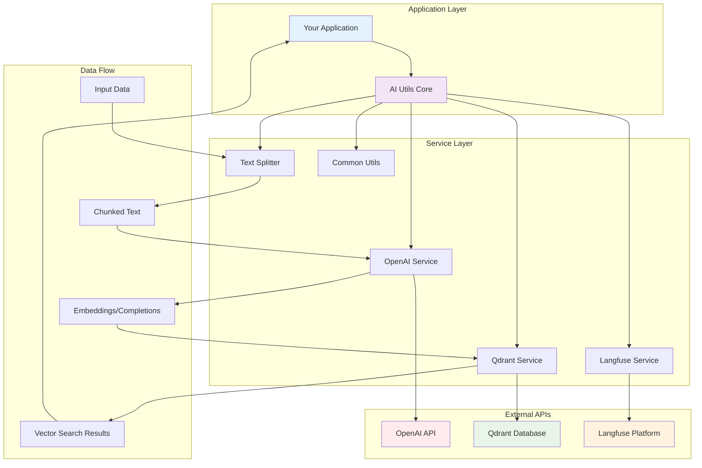
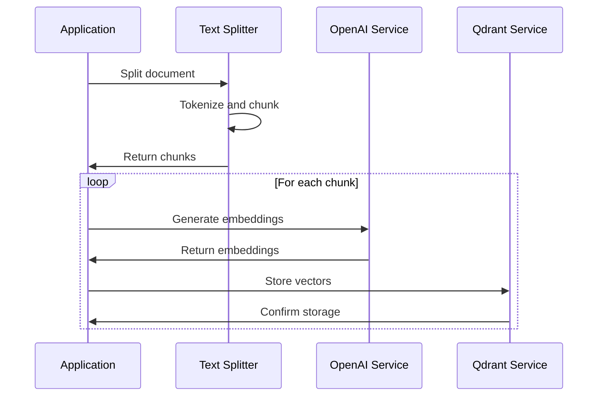
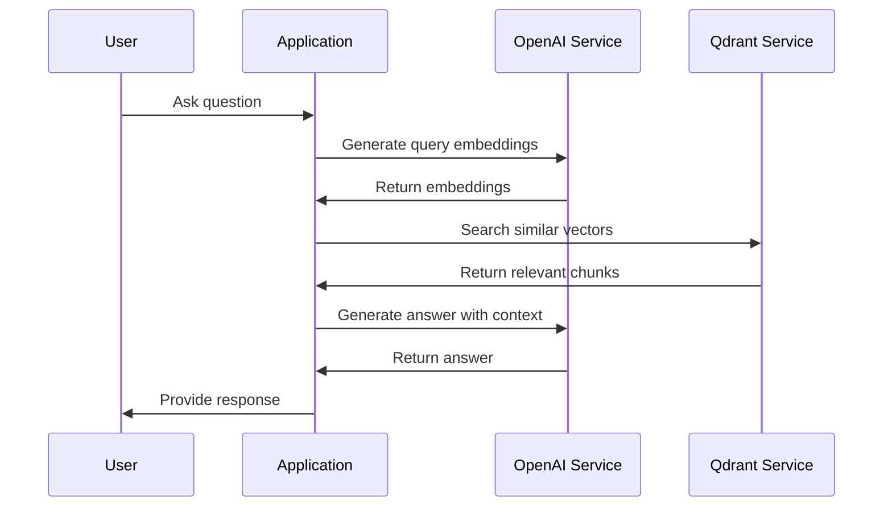
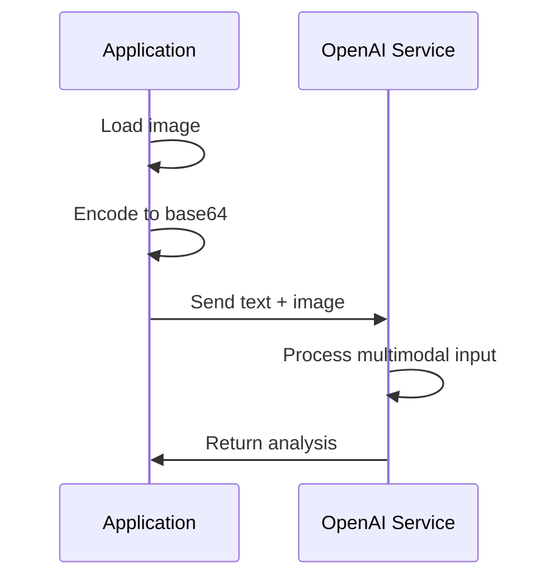

# Architecture Overview

AI Utils is designed with a modular, service-oriented architecture that provides a clean separation of concerns while maintaining high performance and flexibility.

## System Architecture

## Core Components

### 1. Service Layer

The service layer provides the main interfaces for interacting with external APIs and services:

#### OpenAI Service
- **Purpose**: Handles all OpenAI API interactions
- **Capabilities**: Chat completions, embeddings, image generation, audio transcription
- **Key Features**: 
  - Async operations with proper error handling
  - Support for multiple models (GPT-3.5, GPT-4, GPT-4 Vision)
  - Multimodal capabilities (text + image)

#### Qdrant Service
- **Purpose**: Vector database operations for semantic search
- **Capabilities**: Collection management, vector storage, similarity search
- **Key Features**:
  - High-performance vector operations
  - Metadata storage with vectors
  - Configurable search parameters

#### Text Splitter
- **Purpose**: Intelligent text chunking for processing large documents
- **Capabilities**: Token-aware splitting, overlap management, metadata preservation
- **Key Features**:
  - Configurable chunk sizes
  - Semantic boundary detection
  - Token counting with tiktoken

#### Langfuse Service
- **Purpose**: AI application monitoring and observability
- **Capabilities**: Trace tracking, span management, performance monitoring
- **Key Features**:
  - Request/response logging
  - Performance metrics
  - Error tracking

### 2. Common Utilities

Shared utilities and types used across all services:

- **Error Handling**: Centralized error types and handling
- **Base64 Encoding**: Image and binary data processing
- **Image Processing**: Image manipulation and format conversion
- **Common Types**: Shared data structures and enums

## Data Flow Patterns

### 1. Document Processing Pipeline

### 2. Query Processing Pipeline

### 3. Multimodal Processing

## Design Principles

### 1. Async-First Design
- All operations are asynchronous using Tokio
- Non-blocking I/O for high performance
- Proper resource management

### 2. Error Handling
- Comprehensive error types with `thiserror`
- Graceful degradation
- Detailed error context

### 3. Type Safety
- Strong typing throughout the codebase
- Rust's ownership system for memory safety
- Compile-time guarantees

### 4. Modularity
- Clear separation between services
- Minimal coupling between components
- Easy to extend and customize

### 5. Configuration
- Environment-based configuration
- Sensible defaults
- Easy to override for different environments

## Performance Considerations

### 1. Connection Pooling
- Reuse HTTP connections where possible
- Efficient resource utilization
- Reduced latency

### 2. Batch Operations
- Support for batch processing where available
- Reduced API calls
- Better throughput

### 3. Caching
- Embedding caching for repeated text
- Vector search result caching
- Configurable cache strategies

## Security

### 1. API Key Management
- Environment variable configuration
- No hardcoded secrets
- Secure key rotation support

### 2. Data Privacy
- Local processing where possible
- Minimal data transmission
- Configurable data retention

### 3. Input Validation
- Comprehensive input sanitization
- Rate limiting support
- Malicious input protection

## Extensibility

The architecture is designed to be easily extensible:

- **New Services**: Add new service modules following the existing patterns
- **Custom Models**: Support for different AI models and providers
- **Storage Backends**: Pluggable vector database implementations
- **Monitoring**: Extensible monitoring and logging

## Next Steps

- [Async Operations](async-operations.md) - Learn about async patterns
- [Error Handling](error-handling.md) - Understand error management
- [OpenAI Integration](../modules/openai/overview.md) - Deep dive into AI capabilities
- [Vector Search](../modules/qdrant/overview.md) - Explore semantic search
